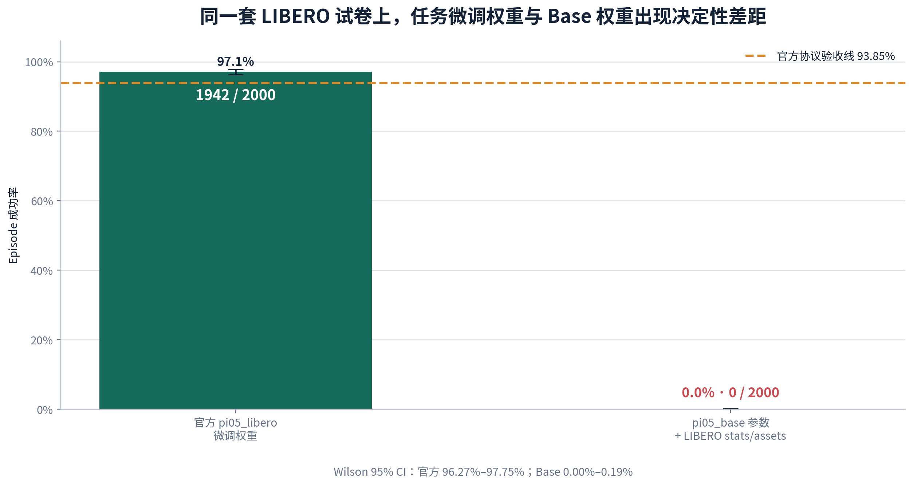
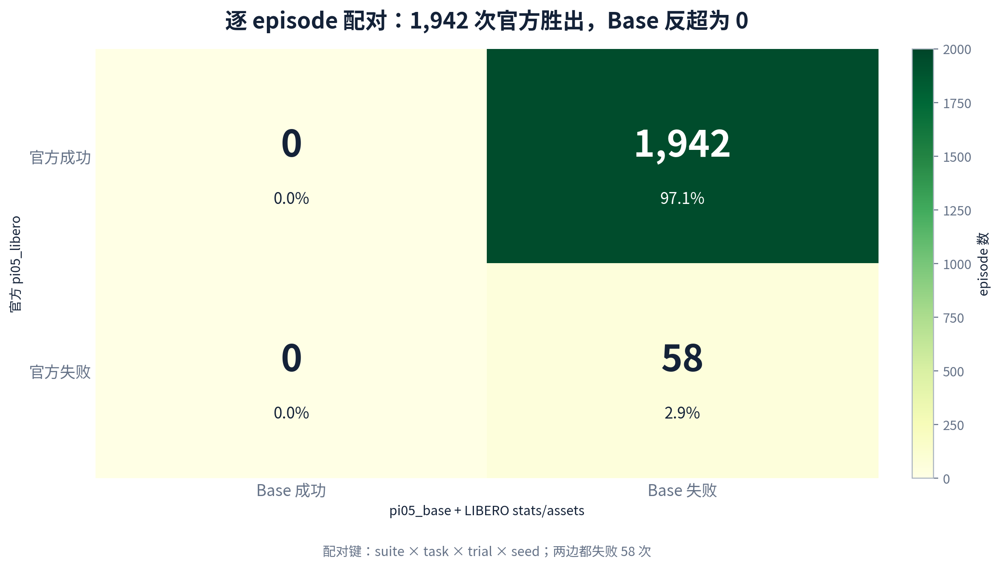
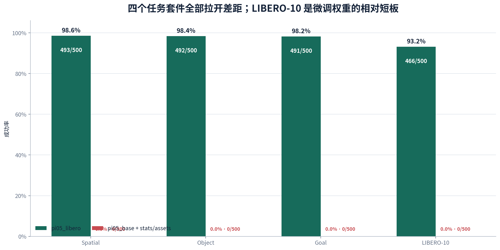
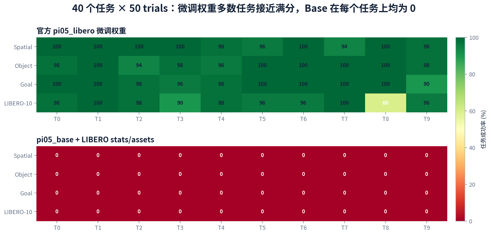
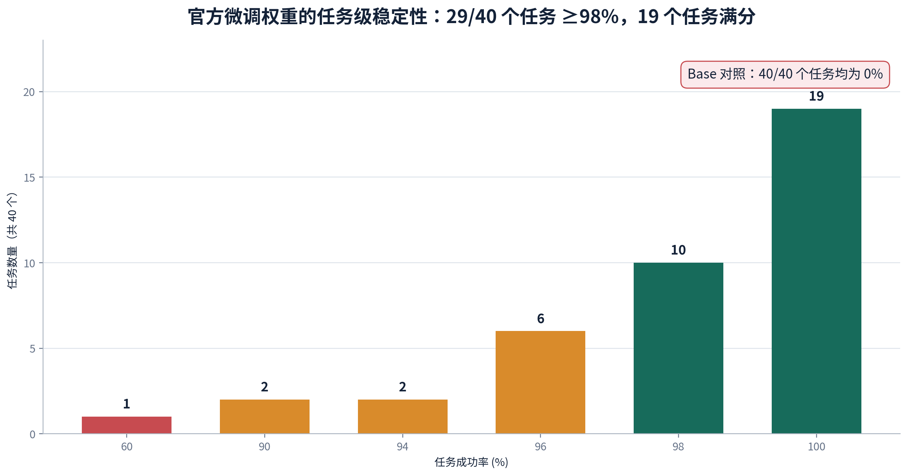
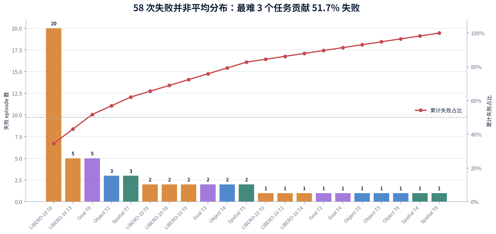
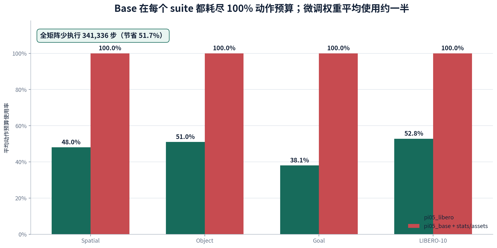
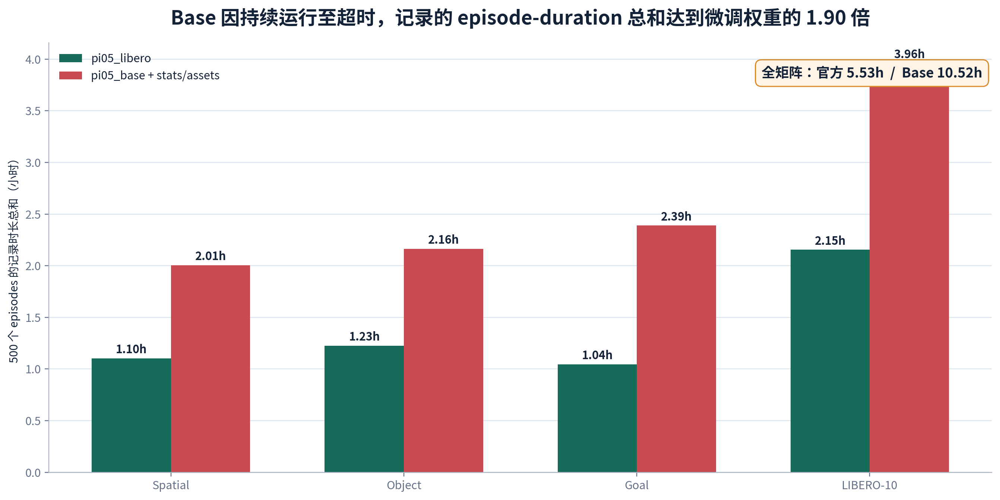
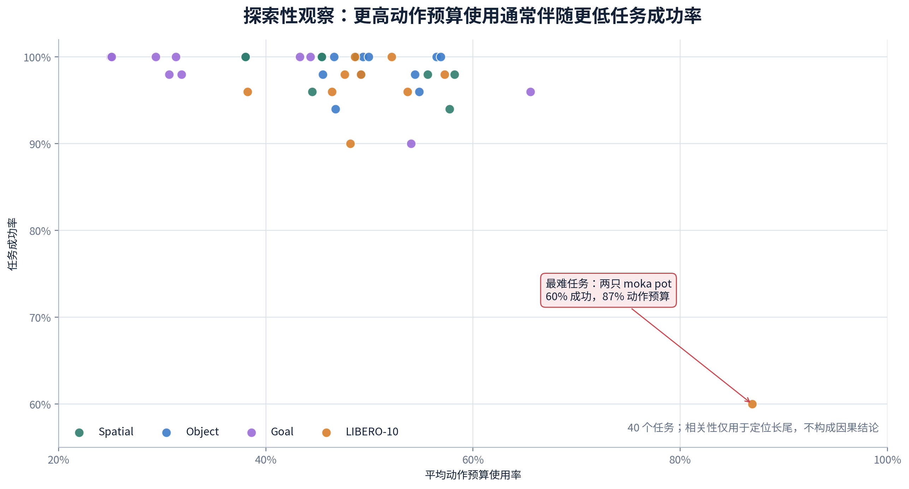

# 官方 pi05_libero vs pi05_base：LIBERO 本体对比 PPT 分析稿

## 使用说明

本文按 PPT 页组织，可直接复制为汇报讲稿。可编辑演示文稿见 `OpenPI_pi05_LIBERO_权重对比分析.pptx`，所有高清图表位于 `figures/`，精确数据位于 `data/`。

## 第 1 页｜封面

**标题：** OpenPI π0.5 权重在 LIBERO 本体上的对比评测  
**副标题：** 官方 `pi05_libero` 微调权重 vs `pi05_base` 参数 + 官方 LIBERO stats/assets

## 第 2 页｜为什么这是一组公平对照

两份权重面对完全相同的 **4 suites × 10 tasks × 50 trials = 2000 episodes**。每个 `(suite, task, trial, seed)` 一一对应，任务描述和最大步数完全相同。固定参数为 seed 7、224×224 图像、每次重规划执行 5 步动作、10 步初始等待、EGL。

Base 对照不是 Base-native：它使用 `pi05_base` 参数，但刻意搭配官方 LIBERO assets 与 norm stats，目的是排除“输入尺度或资源不匹配”这一解释。Base-native 因缺少 LIBERO norm stats 为 N/A，不纳入本页 0% 对照。

## 第 3 页｜总体结果：97.10% vs 0%

- 官方微调权重：**1942/2000 = 97.10%**，Wilson 95% CI 96.27%–97.75%。
- Base+stats/assets：**0/2000 = 0%**，Wilson 95% CI 0.00%–0.19%。
- 观察差距：**97.1 个百分点**。
- 按 40 个任务配对 bootstrap（100,000 次）估计，差距的 95% 区间为 **94.80–98.65 个百分点**。
- 官方权重超过项目预设 93.85% 验收线。

## 第 4 页｜逐 episode 配对结果

| | Base 成功 | Base 失败 |
|---|---:|---:|
| 官方成功 | 0 | 1942 |
| 官方失败 | 0 | 58 |

2000 个完全对齐的 episode 中，官方权重胜出 1942 次，Base 胜出 0 次；两边一致的 58 次全部是共同失败。换句话说，Base 没有在任何一个 trial 上反超官方权重。

## 第 5 页｜Suite 分解：差距覆盖全部任务类型

| Suite | 官方成功/总数 | 官方成功率 | Base 成功/总数 |
|---|---:|---:|---:|
| Spatial | 493/500 | 98.60% | 0/500 |
| Object | 492/500 | 98.40% | 0/500 |
| Goal | 491/500 | 98.20% | 0/500 |
| LIBERO-10 | 466/500 | 93.20% | 0/500 |

LIBERO-10 为微调权重相对短板（93.20%），反映长时序、多物体和多阶段任务更难；但 Base 在四个 suite 均为 0/500，因此并非单一 suite 的偶发问题。

## 第 6 页｜40 个任务热力图

官方权重在多数任务上接近满分；Base 的 40 个任务全部为 0%。同题同 trial 的配对矩阵，使结果不会被任务组成差异解释。

## 第 7 页｜任务级稳定性

- 19/40 个任务为 50/50，即 100%；
- 29/40 个任务 ≥98%；
- 37/40 个任务 ≥94%；
- 只有 3 个任务低于 94%，其中 1 个明显长尾任务为 60%。

## 第 8 页｜失败长尾与 Pareto 分布

官方权重只有 58 次失败，但前 3 个困难任务贡献 51.7% 失败，前 5 个贡献 62.1%，前 10 个贡献 79.3%。最难任务为：

> `put both moka pots on the stove`：30/50 = 60%

这说明“总体 97.10%”不等于所有任务同样可靠，剩余风险集中在少数长时序任务。

## 第 9 页｜动作预算：Base 不是很快失败，而是持续尝试后超时

- Base 的 2000 次失败全部执行到 suite 最大步数，四个 suite 的平均动作预算使用率均为 100%；
- 微调权重全矩阵共执行 318,664 步，Base 执行 660,000 步；
- 微调权重少执行 **341,336 步，即 51.7%**。

## 第 10 页｜运行成本：Base 失败会消耗更多评测时间

- 官方权重记录的 episode-duration 总和：5.53 小时；
- Base：10.52 小时，是前者的 1.90 倍；
- 官方 episode 时长中位数 8.58s，Base 为 15.98s。

注意：这是 episode 记录时长总和，适合比较评测成本，不应解释为真实机器人生产节拍。

## 第 11 页｜任务效率的探索性观察

更高动作预算使用通常伴随更低任务成功率，最难的两只 moka pot 任务尤其突出。该关系用于定位困难任务，不构成“动作多必然导致失败”的因果结论。

## 第 12 页｜为什么这些结果可信

- 两份权重均为 2000 个唯一 episode、2000 个唯一 attempt；
- 矩阵均严格覆盖 4 suites × 10 tasks × 50 trials；
- 每份结果均有 2000 个非空录像与记录一一对应；
- 基础设施错误为 0；
- 成功率从原始 JSONL 重新计算，而非只信任 summary；
- checkpoint 参数树、norm stats、OpenPI commit、环境和日志均有 manifest/hash 证据；
- 最终审计状态为 `passed`。

## 第 13 页｜结论与边界

### 能说明什么

1. 在固定原始 LIBERO 协议下，官方任务微调权重具备强任务能力；
2. `pi05_base` 即使获得相同的 LIBERO assets/norm stats，也无法完成任务；
3. 因而 norm stats 只能匹配数据尺度，不能替代任务微调形成的行为能力；
4. 微调权重的剩余风险集中在少数长时序任务，可针对性优化。

### 不能说明什么

1. 不能把仿真结果直接等同于真实机器人安全或生产可用性；
2. 不能证明 Base 模型在其他任务或经过其他适配后必然失败；
3. 本次环境 seed 固定为 7，不能代表跨 seed 方差；
4. 97.1 个百分点是当前配对协议下的观察差距，不是对“所有微调方法”的普遍因果估计。

### 汇报用一句话

> **同一套 2000-episode LIBERO 试卷中，官方 pi05_libero 微调权重达到 97.10%，而 pi05_base 即使搭配官方 LIBERO stats/assets 仍为 0%；这证明任务微调权重而非仅数据归一化，是获得 LIBERO 操作能力的决定性因素。**

## 附录｜数据与复现

- `data/metrics.json`：机器可读全指标；
- `data/suite_comparison.csv`：suite 对比；
- `data/task_comparison.csv`：40 个任务对比；
- `data/worst_tasks.csv`：失败 Pareto；
- `figures/*.png`：PPT 高清图；
- `figures/*.svg`：矢量图；
- `generate_ppt_report.py`：可复现生成脚本。
