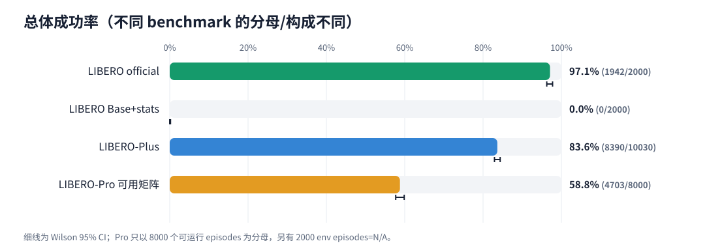
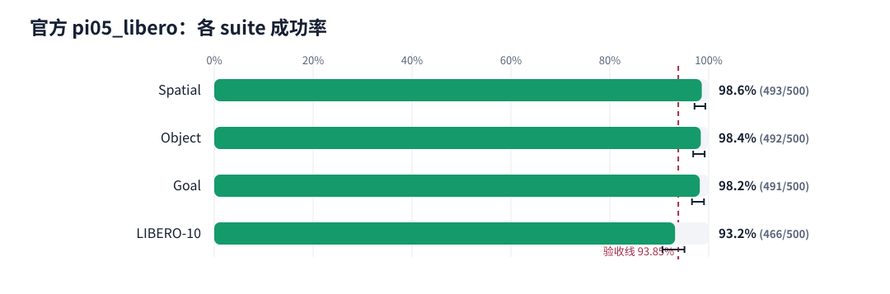
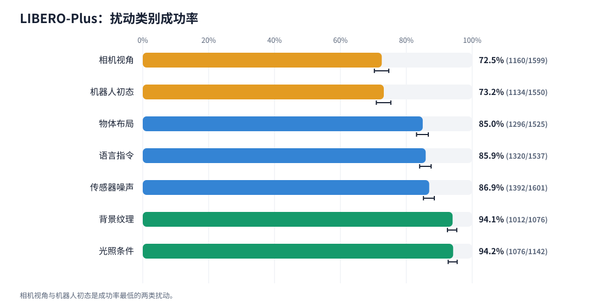
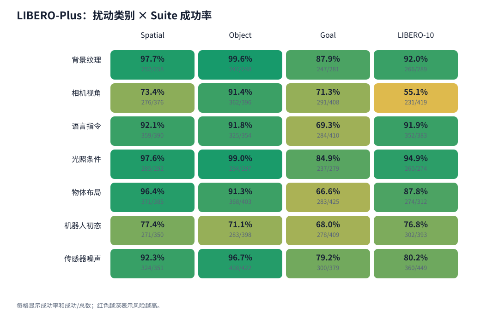
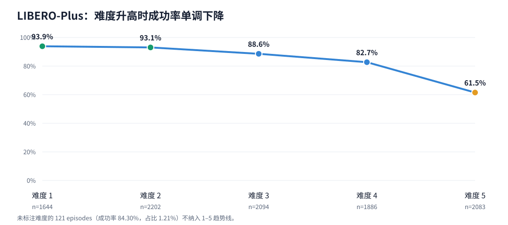
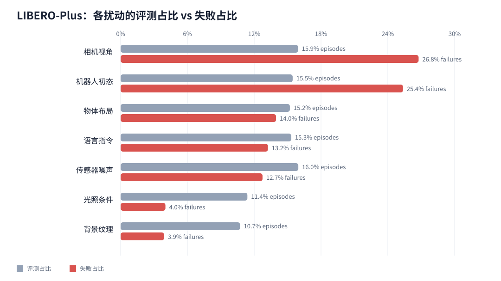
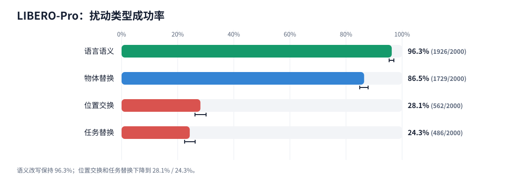
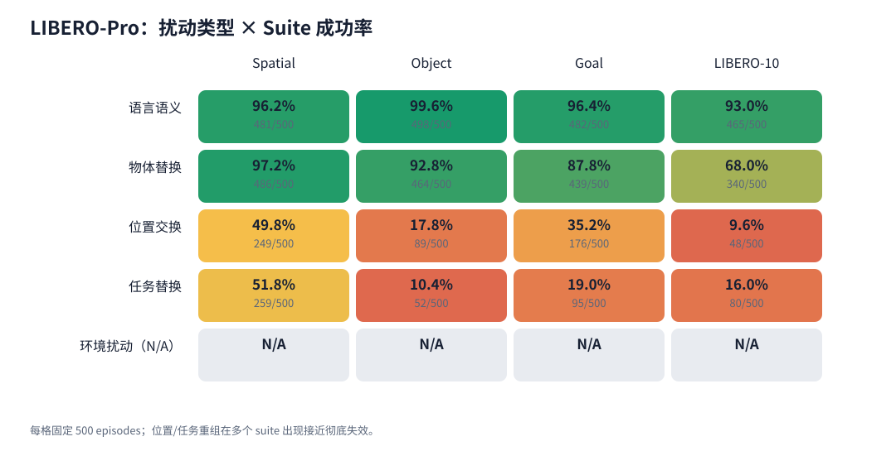
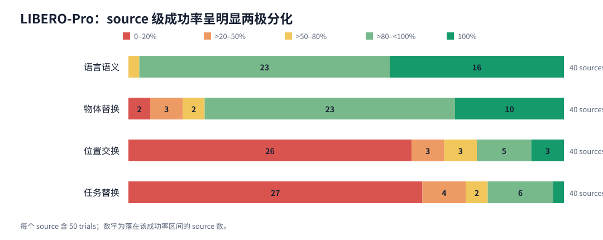
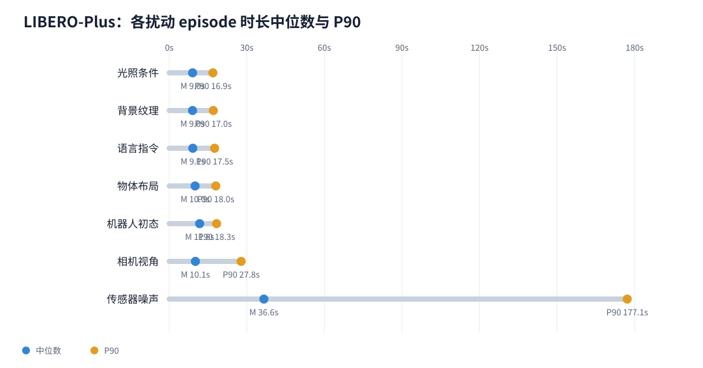

# OpenPI π0.5 × LIBERO 数据分析报告

> 基于 22,030 个已完成、可审计的 episode 终态重新统计。最终审计状态：**passed**；基础设施错误：**0**。

## 执行摘要

- **官方 LIBERO 微调权重达到 97.10%**（1942/2000），四个 suite 宏平均为 97.10%，高于 93.85% 验收线。
- **Base 参数即使搭配官方 LIBERO norm stats/assets，仍为 0/2000**。与官方协议的差距是 97.1 个百分点，表明 norm stats 无法替代任务微调权重。
- **LIBERO-Plus 为 83.65%**（8390/10030）。相机视角和机器人初态只占 31.4% 评测量，却贡献 52.1% 失败。
- **Plus 难度 1 到 5 从 93.86% 降至 61.50%**，净下降 32.4 个百分点；难度 4–5 占 39.6% episodes，却占 68.8% 失败。
- **LIBERO-Pro 可用矩阵为 58.79%**（4703/8000）。语义改写为 96.30%，位置交换和任务替换分别仅 28.10% / 24.30%，两者贡献 89.5% 失败。
- **Sensor Noise 是运行时间长尾的核心来源**：只占 16.0% Plus episodes，却占 53.5% episode-duration 总和；中位数 36.6s，P90 177.1s。
- 全部普通策略失败都精确走满 episode 步数上限，无异常中断或连接/EGL 错误被混入失败率。

## 1. 总体结果

| Benchmark | 协议 | 已评/协议 | 成功/已评 | 成功率 | Wilson 95% CI | Infra |
| --- | --- | ---: | ---: | ---: | ---: | ---: |
| LIBERO official | pi05_libero | 2000/2000 | 1942/2000 | 97.10% | 96.27%–97.75% | 0 |
| LIBERO Base+stats | pi05_base + LIBERO assets | 2000/2000 | 0/2000 | 0.00% | 0.00%–0.19% | 0 |
| LIBERO Base-native | pi05_base native assets | 0/2000 (N/A) | N/A | N/A | N/A | 0 |
| LIBERO-Plus | pi05_libero | 10030/10030 | 8390/10030 | 83.65% | 82.91%–84.36% | 0 |
| LIBERO-Pro 可用矩阵 | pi05_libero | 8000/10000 | 4703/8000 | 58.79% | 57.70%–59.86% | 0 |

上表的置信区间是 episode 级 Wilson 区间。它表达当前 episode 样本的二项不确定性，不消除同一 task/source 内的相关性。因 benchmark 的任务构成不同，不应把 Plus 和 Pro 的总成功率差直接解释为单一扰动的因果效应。

## 2. 原始 LIBERO：微调权重的作用

| Suite | 成功/总数 | 成功率 | Wilson 95% CI |
| --- | ---: | ---: | ---: |
| Spatial | 493/500 | 98.6% | 97.1%–99.3% |
| Object | 492/500 | 98.4% | 96.9%–99.2% |
| Goal | 491/500 | 98.2% | 96.6%–99.1% |
| LIBERO-10 | 466/500 | 93.2% | 90.6%–95.1% |

官方权重的 58 次失败并非均匀分布：最难的 `put both moka pots on the stove` 任务为 30/50，单任务贡献 20 次失败；失败最多的前三个任务共占 51.7% 全部失败。这说明 97.10% 的余下风险高度集中在少数长时序/多步任务，而不是全面退化。

在同样的 4 suites × 10 tasks × 50 trials 矩阵上，`pi05_base + LIBERO assets` 为 0/2000，且 2000 次均走满步数上限。这是一个强对照：预处理统计匹配了输入尺度，但没有赋予 Base 模型 LIBERO 任务能力。Base-native 则因缺少 `physical-intelligence/libero/norm_stats.json` 记为 N/A，不是 0%。

## 3. LIBERO-Plus：主要短板是视角、初态和高难度

Plus episode 微平均为 83.65%，四个 suite 等权宏平均为 83.78%。两者接近，但 category/difficulty 的分母不均匀，不应把不同维度的平均数混为同一指标。

| 扰动类别 | 成功/总数 | 成功率 | 失败数 |
| --- | ---: | ---: | ---: |
| 背景纹理 | 1012/1076 | 94.1% | 64 |
| 相机视角 | 1160/1599 | 72.5% | 439 |
| 语言指令 | 1320/1537 | 85.9% | 217 |
| 光照条件 | 1076/1142 | 94.2% | 66 |
| 物体布局 | 1296/1525 | 85.0% | 229 |
| 机器人初态 | 1134/1550 | 73.2% | 416 |
| 传感器噪声 | 1392/1601 | 86.9% | 209 |

类别平均会掩盖明显的 suite 交互：背景纹理在 Object 上达 99.60%，而相机视角在 LIBERO-10 上只有 55.13%；机器人初态在四个 suite 都处于 67.97%–77.43% 低位，表明它是更普遍的鲁棒性短板。

难度曲线单调下降，且失败不成比例地集中在难度 4–5。从研发优先级看，先聚焦「相机视角 × 难度 5」和「机器人初态 × 难度 4–5」，比对全部类别平均用力更有可能快速降低失败数。

## 4. LIBERO-Pro：语义稳健，几何与任务转移是主要瓶颈

| 扰动 | 成功/总数 | 成功率 | 失败数 |
| --- | ---: | ---: | ---: |
| 语言语义 | 1926/2000 | 96.3% | 74 |
| 物体替换 | 1729/2000 | 86.5% | 271 |
| 位置交换 | 562/2000 | 28.1% | 1438 |
| 任务替换 | 486/2000 | 24.3% | 1514 |

语义改写在四个 suite 上都保持 93.0%–99.6%，物体替换也仍有 68.0%–97.2%。相比之下，位置交换在 LIBERO-10 仅 9.6%，任务替换在 Object 仅 10.4%。这表明模型对语言表达形式较稳健，但对「物体—位置—操作目标」关系的重组明显更脆弱。

Pro 的每个 perturbation 含 40 个 sources，每 source 50 trials。位置交换有 20/40 个 source 完全失败，任务替换为 19/40；两者的 source 成功率中位数分别只有 1% 和 2%。因此低均值不是「所有任务都小幅变差」，而是大量 source 接近彻底失效、少数 source 仍高成功的两极分化。

Pro 快照中缺少 4 个 `env` cells，各 500 episodes，共 2000。本报告的 58.79% 只以 8000 个可运行 episodes 为分母；缺失部分明确是 N/A，不是策略失败。

## 5. 运行成本：Sensor Noise 造成明显时间长尾

Sensor Noise 的 1601 episodes 只占 Plus 矩阵 16.0%，但占 episode-duration 总和 53.5%。其平均时长 72.1s、中位数 36.6s、P90 177.1s、P99 463.2s；有 542 条超过 60s，309 条超过 120s。这解释了 Plus 运行后半段的时间长尾。

注意：这里的 duration 是各 episode 记录时长，并行 GPU/server 下可以重叠，因此其总和不是真实墙钟时间；它适合用于定位类别级运行成本。

## 6. 结论与优先级

1. **微调权重是必需项。** Base+stats 对照证明数据归一化不能替代 LIBERO 任务微调。
2. **首优先修复几何泛化。** Plus 的视角/初态、Pro 的位置/任务重组是失败最集中的方向。
3. **训练和回归集应按「扰动 × suite × 难度」分层。** 仅看总成功率会漏掉如 Camera×LIBERO-10=55.13% 这类高价值短板。
4. **保留 source/task 级指标。** Pro 的两极分化说明后续不应只汇报 episode micro-average，还应跟踪零成功 source 数和 source 中位数。

## 7. 方法和可审计文件

- 分析对象：`official-full` 2000 + `base-libero-assets-full` 2000 + Plus 10030 + Pro 8000 = **22,030 episodes**。
- 所有记录均为唯一 terminal episode/attempt，`error_category=null`，录像集与记录精确匹配。
- 派生数据：[`data/`](data/)；机器可读总指标：[`metrics.json`](data/metrics.json)。
- 可复现生成脚本：[`generate_report.py`](generate_report.py)。脚本只使用 Python 标准库，并对已知矩阵大小、唯一 ID、终态、错误分类和录像状态设置硬校验。
- 完整最终审计：[`../plus-pro/final-audit/report.json`](../plus-pro/final-audit/report.json)。

### 解读边界

- Plus 每个生成变体只有 1 次 trial；其区间表达变体 episode 集合的不确定性，不是单一变体的重复成功率。
- Pro 每 source 有 50 trials，同 source 内并非完全独立；因此同时报告 source 分布。
- Plus 为了完成大矩阵，按 suite 使用独立 policy server 分片；环境 seed=7，policy JAX RNG key=0 按 server 独立作用。
- 本报告比较是当前固定 checkpoint 和协议下的描述性评测，不是训练方法间的因果实验。

